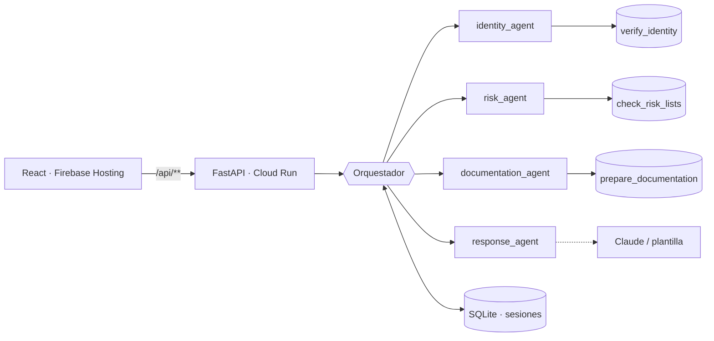

# Onboarding Agéntico: Orquestador Multi-Agente

Un agente orquestador coordina sub-agentes especializados durante el onboarding digital de un
prospecto: verifica identidad, consulta listas de riesgo, prepara la documentación según las
políticas del banco y genera la respuesta al cliente. El orquestador controla qué herramientas
puede usar cada agente, maneja el estado entre pasos y escala ante incertidumbre con una
solución propuesta.

**Stack:** FastAPI (Python 3.12) en Cloud Run · React + Vite en Firebase Hosting · SQLite para el estado · Claude (opcional) para redactar el mensaje al cliente.

📐 Diagramas (Mermaid): [docs/ARCHITECTURE.md](docs/ARCHITECTURE.md)



## Estructura

```
backend/app/
├── main.py                  # app factory FastAPI
├── api/                     # capa HTTP
│   ├── deps.py              #   composition root (inyección de dependencias)
│   └── v1/routes.py         #   endpoints versionados
├── orchestration/
│   └── orchestrator.py      # supervisor + máquina de estados
├── agents/                  # sub-agentes especializados
│   ├── base.py              #   contrato SubAgent / AgentResult
│   ├── identity.py · risk.py · documentation.py · response.py
├── tools/
│   ├── gateway.py           # allowlist por agente, reintentos, auditoría
│   └── mocks.py             # Tool 1, 2, 3 (mock deterministas)
├── domain/
│   ├── models.py            # contratos Pydantic y estado de sesión
│   └── policies.py          # motor de reglas por producto
├── infrastructure/
│   └── repository.py        # SessionRepository (SQLite)
└── core/config.py           # settings por variables de entorno

frontend/src/
├── app/                     # shell y providers
├── components/ui/           # shadcn/ui
├── components/layout/
└── features/onboarding/     # api, hooks, componentes del caso
```

## Cumplimiento del caso

| Requisito | Implementación |
|---|---|
| Recibir solicitud | `POST /api/v1/onboarding/start` con validación Pydantic |
| Determinar si es apto bajo políticas | `app/domain/policies.py`: motor de reglas por producto (APTO / NO_APTO / REVISION_MANUAL) |
| Falla o ambigüedad, proponer solución | `Escalation.proposed_solution` en cada agente + `POST /resolve` (human-in-the-loop) |
| Tool 1 `verify_identity` (confianza < 0.8 escala) | `app/tools/mocks.py` + `app/agents/identity.py` |
| Tool 2 `check_risk_lists` (high escala) | `app/tools/mocks.py` + `app/agents/risk.py` |
| Tool 3 `prepare_documentation` | `app/tools/mocks.py` + `app/agents/documentation.py` (+EDD si riesgo medio) |
| Control de herramientas por agente | `app/tools/gateway.py`: allowlist, reintentos con backoff y log de auditoría |
| Manejo de estado conversacional | `OnboardingSession` (pasos, blackboard, conversación) persistida en SQLite tras cada paso |

## API

| Método | Ruta | Descripción |
|---|---|---|
| POST | `/api/v1/onboarding/start` | Inicia y ejecuta el onboarding |
| GET | `/api/v1/onboarding/{id}` | Estado de la sesión |
| POST | `/api/v1/onboarding/{id}/resolve` | Resolución humana de una sesión `ESCALATED` |
| GET | `/api/v1/onboarding` | Sesiones recientes |
| GET | `/api/v1/onboarding/scenarios` | Escenarios de demo |
| GET | `/api/v1/agents` | Matriz agente → herramientas |
| GET | `/docs` | OpenAPI / Swagger |

```bash
curl -X POST localhost:8000/api/v1/onboarding/start -H "Content-Type: application/json" \
  -d '{"prospect_name":"Juan Perez","document_id":"1712345678","product":"cuenta_ahorros"}'
```

### Escenarios de demo (mocks deterministas)

| document_id | Escenario | Resultado |
|---|---|---|
| 1712345678 | Camino feliz | APTO |
| 0912345678 | Identidad con confianza 0.62 | REVISION_MANUAL (biometría) |
| 1799999999 | Coincidencia OFAC (high) | REVISION_MANUAL (Cumplimiento) |
| 1755555555 | Riesgo medio (PEP) | APTO + EDD (en tarjeta de crédito: revisión) |
| 0000000000 | Identidad no verificada | NO_APTO |
| 1700000500 | Registro Civil caído | 3 reintentos, luego REVISION_MANUAL |
| 1700000501 | Falla transitoria | se recupera al 2.º intento, APTO |

## Ejecutar localmente

```bash
# Backend
cd backend
python -m venv .venv && .venv/Scripts/activate   # en Linux/Mac: source .venv/bin/activate
pip install -r requirements.txt
pytest -q                                          # 11 tests
uvicorn app.main:app --reload --port 8000

# Frontend (otra terminal)
cd frontend && npm install && npm run dev          # http://localhost:5173 (proxy /api → :8000)
```

Opcional: `export ANTHROPIC_API_KEY=...` para que `response_agent` redacte con Claude
(`claude-opus-5`, effort bajo). Sin la variable usa plantillas, y la decisión nunca depende del LLM.

## Desplegar en GCP

```bash
npm i -g firebase-tools && firebase login && gcloud auth login
PROJECT_ID=<tu-proyecto> ./deploy.sh
```

- **Cloud Run** (`onboarding-api`, `max-instances=1` por SQLite). Entra en la capa gratuita.
- **Firebase Hosting** sirve el SPA y reescribe `/api/**` hacia Cloud Run (mismo origen, sin CORS).
- Cloud Run requiere un proyecto con facturación habilitada (plan Blaze), aunque el uso de la demo queda en la capa gratuita.

## Próximos pasos hacia producción

- `SessionRepository` sobre Cloud SQL (PostgreSQL) para escalar horizontalmente.
- Adaptadores reales (Registro Civil, OFAC/ONU/UAFE, gestor documental) detrás del mismo `ToolGateway`.
- Autenticación (Identity Platform) y rol "revisor" para `/resolve`.
- Ejecución asíncrona (Cloud Tasks / Pub/Sub) para tools lentas y reintentos diferidos.
