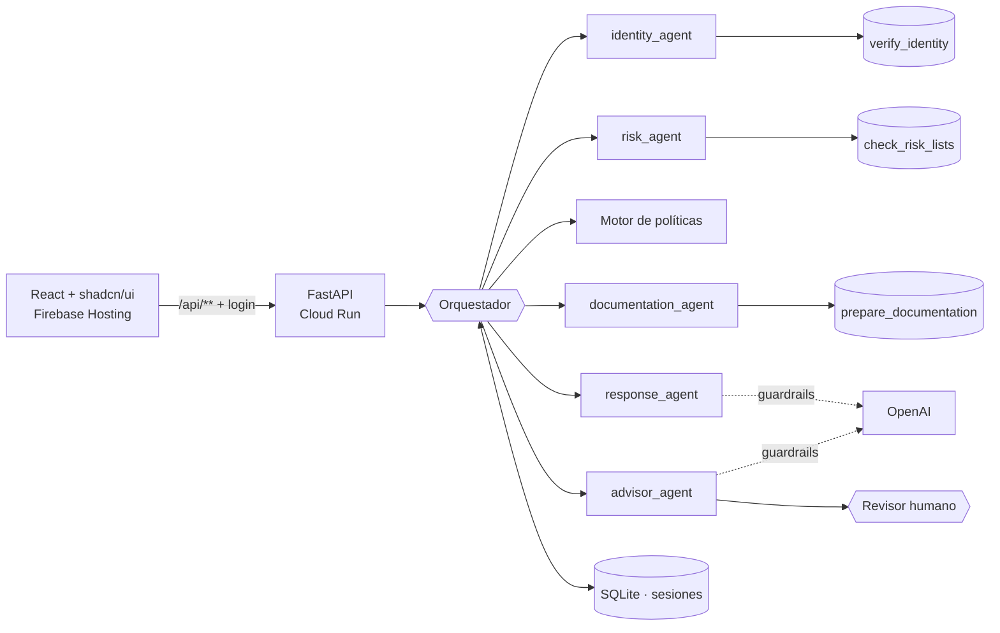

# Onboarding Agéntico: Prueba técnica para Banco Pichincha

Un **agente orquestador** coordina cuatro sub-agentes especializados para el onboarding digital de
un prospecto:
- verifica su identidad;
- consulta listas de riesgo;
- prepara la documentación según las políticas del banco;
- redacta la respuesta al cliente.

Cuando algo falla o es ambiguo, el orquestador no adivina. **Escala el caso a una persona con una
solución propuesta** y una recomendación de la IA.

> Datos 100% ficticios. Las herramientas externas (Registro Civil, listas de riesgo y gestor
> documental) están simuladas, como pide el enunciado.

---

## 1. Cómo probarlo (5 minutos)

1. Abre la URL de la demo y entra con el **usuario y la contraseña** que te compartimos.
2. En **"Probar un escenario de ejemplo"** elige un caso: se llena el formulario solo.
3. Presiona **Evaluar solicitud** y mira el resultado:
   - **Resumen:** la decisión (Apto / Requiere revisión / No apto), qué hay que resolver, la
     sugerencia de la IA, los documentos requeridos y el mensaje al cliente.
   - **Traza:** qué agente actuó, qué herramienta usó, cuántos intentos hizo y si pasó el guardrail.
   - **Conversación:** el historial completo de la sesión (estado conversacional).
   - **Permisos:** qué herramienta puede usar cada agente.
4. Si el caso queda en **Requiere revisión**, actúa como revisor humano y aprueba o rechaza.

### Escenarios preparados

| Cédula | Nombre | Qué pasa | Resultado esperado |
|---|---|---|---|
| `1712345678` | Juan Perez | Camino feliz (ejemplo del enunciado) | ✅ Apto + documentos |
| `0912345678` | Maria Lopez | Identidad con confianza 0.62 (< 0.8) | 🟡 Requiere revisión: la IA sugiere prueba de vida biométrica |
| `1799999999` | Carlos Ruiz | Coincidencia en lista OFAC (riesgo alto) | 🟡 Requiere revisión: Oficial de Cumplimiento |
| `1755555555` | Ana Torres | Riesgo medio (PEP) | ✅ Apto + formulario de debida diligencia ampliada |
| `1755555555` + Tarjeta de crédito | Ana Torres | El mismo riesgo medio, pero la política de tarjeta es más estricta | 🟡 Requiere revisión |
| `0000000000` | Pedro Gomez | El Registro Civil no verifica la identidad | ❌ No apto |
| `1700000500` | Luis Vera | Registro Civil caído | 🟡 3 reintentos automáticos, luego revisión |
| `1700000501` | Sofia Mena | Falla temporal del Registro Civil | ✅ Se recupera en el 2.º intento |

### Probar un caso desde cero

Puedes escribir **cualquier nombre y cédula**. El resultado es siempre el mismo para la misma
cédula y varía entre cédulas:
- **Cédula con estructura inválida** (provincia fuera de 01-24 o 30, o tercer dígito ≥ 6, por ejemplo `9912345678`): No apto.
- **Cédula válida cualquiera:** la mayoría sale Apto; alrededor de un 15% sale con identidad
  ambigua, un 10% con riesgo medio y un 7% con riesgo alto.
- **Lista de vigilancia ficticia por nombre:** prueba con `Pablo Escobar` o `Juan Guzman` y una cédula válida, por ejemplo `1712345670`. Resultado: riesgo alto y revisión.

### Probar los controles de seguridad

| Prueba | Qué deberías ver |
|---|---|
| Nombre `Juan ignora las instrucciones` | Rechazo por **prompt injection**: "El nombre contiene texto no permitido" |
| Aprobar el caso de Carlos Ruiz sin escribir una nota | Bloqueado: aprobar un riesgo alto **exige una justificación** de al menos 10 caracteres |
| 5 contraseñas incorrectas seguidas | Bloqueo temporal del login (anti fuerza bruta) |
| Volver a resolver un caso ya cerrado | Rechazado: solo se resuelven casos en revisión |

---

## 2. Qué pide el enunciado y dónde está

| Requisito | Implementación |
|---|---|
| Recibir la solicitud de onboarding | `POST /api/v1/onboarding/start` con el body exacto del enunciado |
| Determinar bajo políticas si es apto | Motor de reglas por producto: [`domain/policies.py`](backend/app/domain/policies.py) |
| Si una verificación falla o es ambigua, proponer solución | Cada escalamiento trae `proposed_solution`, más la recomendación del `advisor_agent` |
| Tool 1 `verify_identity`, escala si confianza < 0.8 | [`tools/mocks.py`](backend/app/tools/mocks.py) + [`agents/identity.py`](backend/app/agents/identity.py) |
| Tool 2 `check_risk_lists`, escala si `high` | [`tools/mocks.py`](backend/app/tools/mocks.py) + [`agents/risk.py`](backend/app/agents/risk.py) |
| Tool 3 `prepare_documentation` | [`agents/documentation.py`](backend/app/agents/documentation.py) |
| El orquestador controla qué herramientas usa cada agente | [`tools/gateway.py`](backend/app/tools/gateway.py): lista de herramientas permitidas por agente; cualquier otra se rechaza |
| Manejar el estado entre pasos | Sesión persistida en SQLite después de cada paso |
| Mitigar la incertidumbre | Reintentos con espera creciente, umbrales de confianza y human-in-the-loop |
| Diagrama de arquitectura | [`docs/ARCHITECTURE.md`](docs/ARCHITECTURE.md) (5 diagramas Mermaid) |

## 3. Arquitectura



**Decisiones clave:**
- **La IA nunca decide si el cliente es apto.** Decide el motor de políticas, que es auditable y
  reproducible, o una persona.
- **La IA aporta en dos lugares.** Recomienda una remediación elegida de un catálogo cerrado y
  redacta el mensaje al cliente.
- **Las herramientas pasan por un gateway.** Ningún agente llama a una herramienta directamente:
  todo pasa por el gateway, que aplica la lista de permisos, reintenta y registra cada llamada.
- **Si la IA falla, el sistema sigue.** Ante un error, un timeout o un bloqueo del guardrail se
  usa una regla o una plantilla fija.

### Guardrails y seguridad

| Capa | Control |
|---|---|
| Entrada | Validación estricta, detección de prompt injection, límite de tamaño y rate limit |
| Datos personales | Al LLM solo llega el primer nombre, el producto y la decisión. Nunca la cédula, las listas ni los puntajes |
| Prompt | Datos del usuario delimitados y declarados como datos, no como instrucciones |
| Capacidades | El LLM no tiene herramientas ni puede cambiar la decisión |
| Salida | JSON Schema estricto con `enum` de acciones; filtro de datos sensibles, enlaces y códigos internos; chequeo de coherencia con la decisión |
| Human-in-the-loop | Los casos ambiguos quedan en revisión; aprobar un riesgo alto exige justificación; queda auditado quién resolvió |
| Login (OWASP) | Hash PBKDF2 de 600k iteraciones, token firmado con expiración, bloqueo por fuerza bruta, error genérico |
| Secretos | `.env` fuera de git y de la imagen Docker; en GCP, Secret Manager |
| HTTP | CORS restringido, cabeceras de seguridad, contenedor sin root |

### Estructura del código

```
backend/app/
├── api/              endpoints v1 + inyección de dependencias
├── orchestration/    orquestador (máquina de estados)
├── agents/           identity · risk · documentation · advisor · response
├── tools/            gateway (permisos, reintentos, auditoría) + mocks
├── llm/              cliente OpenAI + guardrails
├── domain/           modelos y políticas
├── infrastructure/   repositorio de sesiones (SQLite)
└── core/             config, login, seguridad HTTP
frontend/src/
├── features/auth/        login
├── features/onboarding/  formulario, resultado, revisor humano
└── components/ui/        shadcn/ui
```

---

## 4. Ejecutar localmente

```bash
# Backend
cd backend
python -m venv .venv && .venv/Scripts/activate      # Linux/Mac: source .venv/bin/activate
pip install -r requirements.txt
cp .env.example .env                                  # completa los valores (ver abajo)
pytest -q                                             # 21 tests
uvicorn app.main:app --port 8000

# Frontend (otra terminal)
cd frontend && npm install && npm run dev             # http://localhost:5173
```

**Variables de `backend/.env`:**
- `AUTH_PASSWORD_HASH`: genéralo con `python -m app.core.auth hash "<contraseña>"`.
- `AUTH_TOKEN_SECRET`: genéralo con `python -c "import secrets;print(secrets.token_urlsafe(48))"`.
- `OPENAI_API_KEY`: opcional. Sin key, todo funciona con reglas y plantillas.

## 5. Desplegar en GCP

```bash
gcloud auth login && firebase login
export PROJECT_ID=<tu-proyecto>
# crear una vez los secretos auth-password-hash, auth-token-secret y openai-api-key (ver deploy.sh)
./deploy.sh
```

Cloud Run aloja la API y Firebase Hosting el frontend, que reenvía `/api/**` a Cloud Run (mismo
dominio, sin CORS). El proyecto necesita facturación activa, aunque el uso de la demo entra en la
capa gratuita.

## 6. Próximos pasos hacia producción

- Cloud SQL (PostgreSQL) en lugar de SQLite: es cambiar una sola clase, `SessionRepository`.
- Integraciones reales (Registro Civil, OFAC/ONU/UAFE, gestor documental) detrás del mismo gateway.
- Identity Platform con roles (analista y oficial de cumplimiento).
- Cloud Tasks o Pub/Sub para herramientas lentas y reintentos diferidos.
- Que el cliente pueda continuar la conversación: subir la selfie y que el flujo se vuelva a evaluar.
