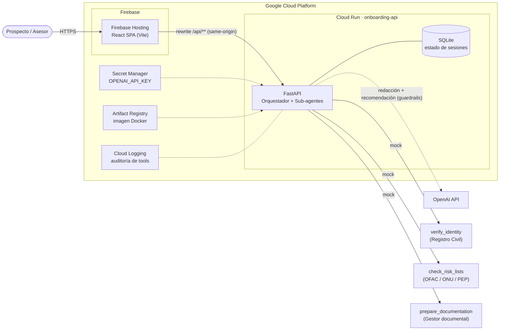
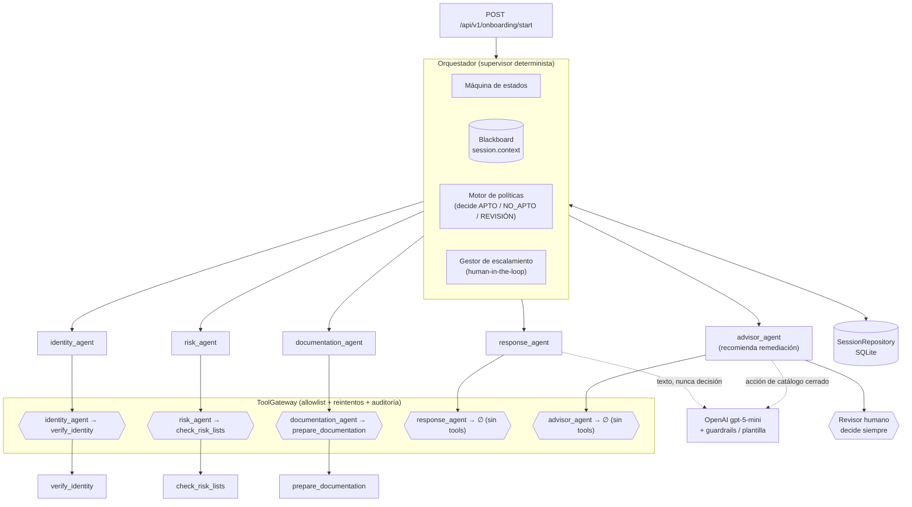
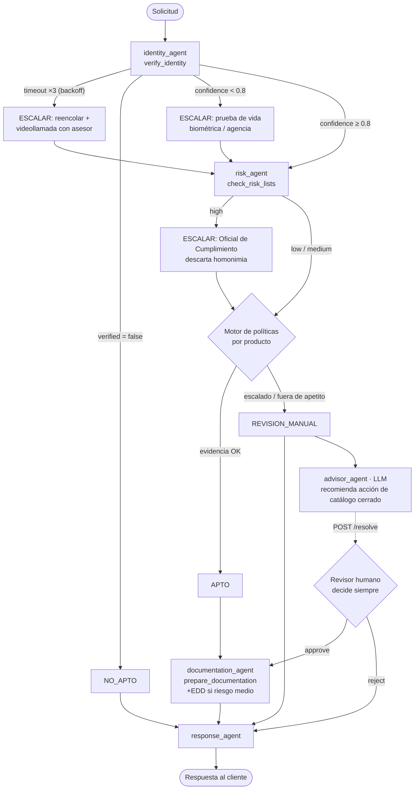
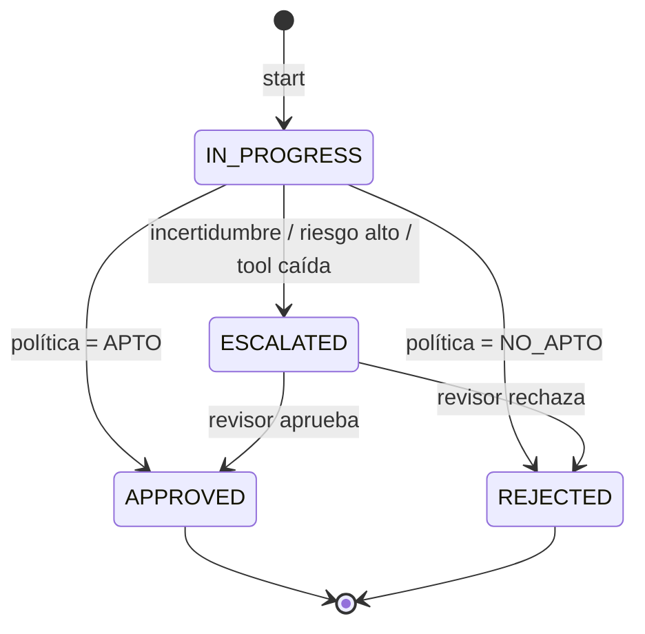
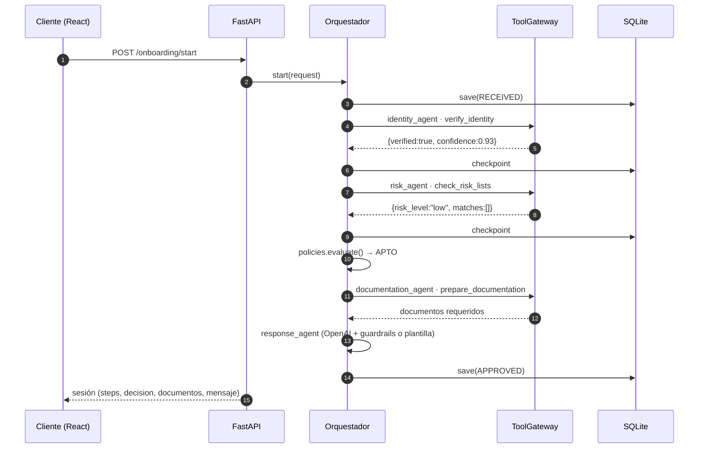

# Arquitectura: Orquestador Agéntico de Onboarding

## 1. Despliegue en GCP

> SQLite vive en `/tmp` del contenedor (demo, `max-instances=1`). Para producción se cambia la
> implementación de `SessionRepository` por Cloud SQL (PostgreSQL) sin tocar el orquestador.

## 2. Orquestador y sub-agentes (control de herramientas)

## 3. Flujo de decisión y mitigación de incertidumbre

## 4. Estados de la sesión (estado conversacional)

## 5. Secuencia (camino feliz)

## Decisiones de diseño

| Decisión | Motivo |
|---|---|
| Supervisor **determinista** (no LLM-router) | En banca la ruta y la decisión deben ser auditables y reproducibles. |
| LLM sin tools y sin poder de decisión | `response_agent` redacta y `advisor_agent` recomienda de un catálogo cerrado; la decisión es del motor de políticas o de un humano. |
| Guardrails en capas | Entrada (validación, anti-injection, minimización de PII) → prompt (datos delimitados) → salida (JSON Schema estricto, filtros, coherencia) → fallback determinista. |
| Human-in-the-loop | Todo caso ambiguo queda ESCALATED; aprobar severidad alta exige justificación. |
| `ToolGateway` con allowlist por agente | Mínimo privilegio; un agente no puede invocar herramientas ajenas (test incluido). |
| Checkpoint del estado tras cada paso | Recuperación ante fallas y trazabilidad completa del caso. |
| Escalamiento con **solución propuesta** | Requisito 3: toda falla/ambigüedad sale con acción concreta para el revisor. |
| Riesgo se consulta aun si identidad escaló | El revisor humano resuelve con evidencia completa. |
| `SessionRepository` como interfaz | SQLite hoy, Cloud SQL / Firestore mañana sin cambiar lógica. |
